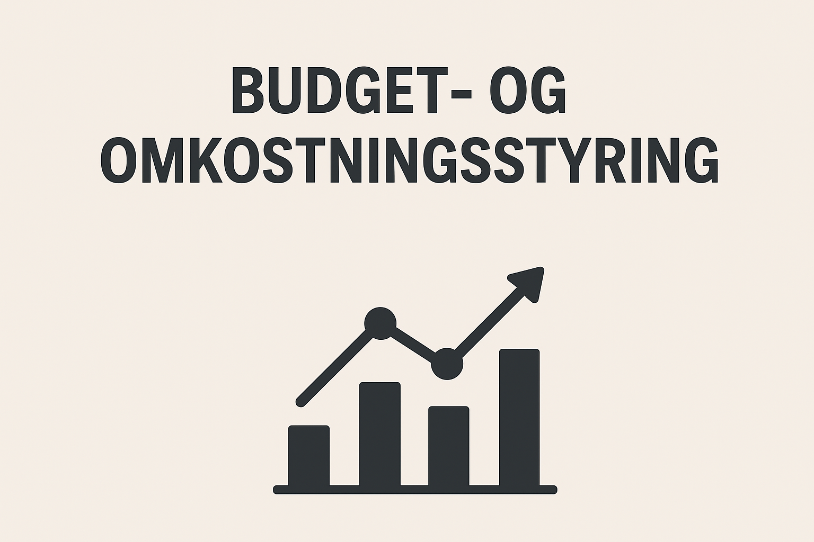
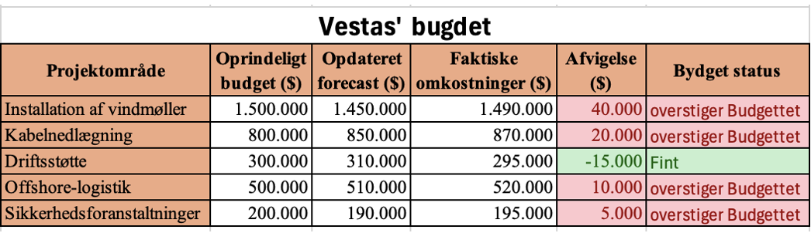
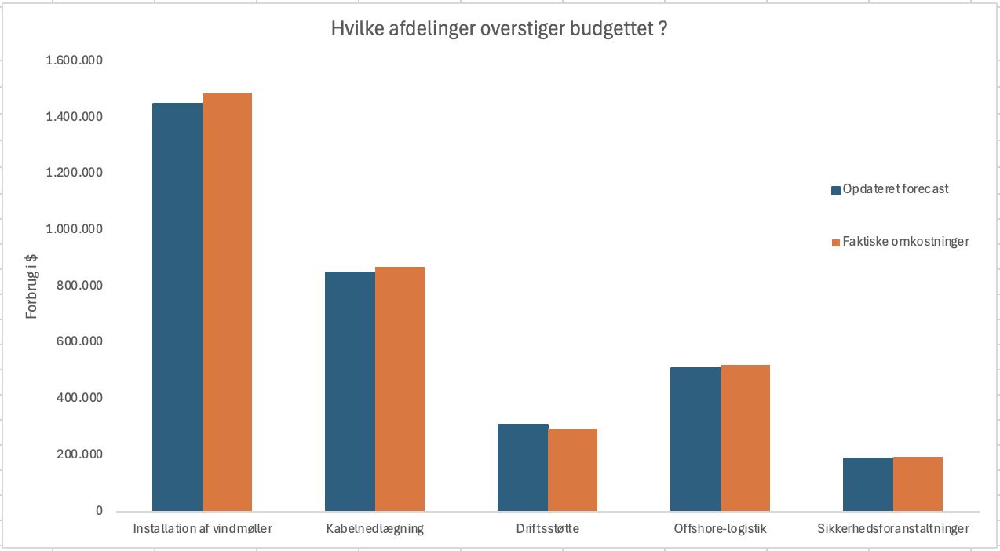
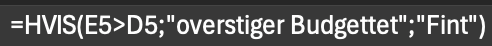

#  Budget og omkostningsstyring

## Litteraturliste

- [Formål](#Formål)
- [User story](#User-story)
- [Objektivitet](#Objektivitet)
- [Bruger detalje](#Bruger-detalje)
  - [Hvad har de svært med](#Hvad-har-de-svært-med) 
  - [Hvad ser succes ud for dem](#Hvad-ser-succes-ud-for-dem)
  - [Hvad skal der bygges](#Hvad-skal-der-bygges)
- [Analyse](#Analyse)
  - [Fund](#Fund)
- [Visualisering](#Visualisering)
- [Handlingsplan](#Handlingsplan)
- [Scenarieanalyse](#Scenarieanalyse)
- [Handlingsplan](#Handlingsplan)

# YouTube Data Analytics: Identifikation af Top Indflydelsesrige i Danmark

## 🚀 Overskuelig oversigt

En komplet dataanalyse-pipeline der ekstraherer, transformerer og visualiserer YouTube-data for at identificere Danmarks mest indflydelsesrige indholdsproducenter. Projektet leverer et interaktivt Power BI-dashboard der giver marketingsafdelinger datadrevne indsigter til partnerudvælgelse og ROI-optimering.

## 🎯 **Forretningsproblemet**

Mærsk's marketingafdeling stod over for udfordringen med at:
*   Identificere de mest effektive YouTube-samarbejdspartnere i det danske marked.
*   Kvantificere det potentielle ROI for kampagner med forskellige indholdsproducenter.
*   Træffe beslutninger baseret på data snarere end subjektive vurderinger.

### Succes for brugeren betyder

•	En overskuelig tabel som viser forbruget
•	Automatisering for markeringen af steder med overforbrug
•	Visualisering af udgifter fordelt på afdelingerne 
•	En scenarieanalyse til at understøtte ledelsens beslutninger

## ⚙️ **Løsningen**

Jeg designede og implementerede en komplet data pipeline:
*   **Data Extraction & Transformation:** SQL-baseret datarensning og transformation af rå YouTube-data.
*   **Avancerede Metrikker:** Udviklede nøgleperformance-indikatorer (engagement rate, gennemsnitlige visninger pr. video).
*   **Interaktivt Dashboard:** Power BI-visualisering der muliggør dynamisk filtrering og sammenligning.
*   **ROI-Analyse:** Simulering af potentielt udbytte baseret på konverteringsrater og produktpriser.

# Analyse

### Fund
Vestas har under deres omstrukturering allerede igangsat opdateret forecast for afdelingerne. Tabellen viser hvorderen pengene er blevet fordelt:

Med allokeringen af pengene til andre afdelinger, som havde et større behov. Sikre Vestas at belastningen under omstruktureringen ikke var mere alvorlig. Udregningen af afvigelserne af budgettet ser ud som følgende:

Afvigelserne i tabellen viser forskellen mellem den forecast og de aktuelle omkostninger. Projektområderne har ifølge analysen ikke holdt sig inden for budgettet. Driftsstøtte som den eneste genereret en besparelse for virksomheden på 15.000 $. 

# Visualisering
Diagrammet forneden illustreret forbruget, og giver et overblik over:

De forventede omkostinger vs. faktiske omkostninger. 
De blå søjler repræsenterer de målte omkostninger i Dollars, hvor de orange repræsenterer de faktiske omkostninger i Dollars:

Betinget formatering er blevet anvendt for at tydeligere hvilke afdelinger, som holdte sig inden for budgettet, de som ikke gjorde:

Den automatiske kategorisering er opnået ved hjælp af HVIS-funktioner i Excel, hvilket reducerer manuel fejlretning og giver et mere skalerbart system

# Budget & Omkostningsstyring: Automatiseret Analyse og Scenarieplanlægning

## 🚀 Overskuelig oversigt

En simuleret budgetanalyse for Vestas, der omdanner komplekse finansielle data til klare, handlekraftige indsigter. Projektet leverer et Excel-baseret værktøj med automatisk afvigelsesdetektion, visualisering og scenarieanalyse designet til at støtte ledelsens beslutningstagning under en omstruktureringsproces.

## 🎯 **Forretningsproblemet**

Under en større omstrukturering stod Vestas over for:
*   Uforudsigelighed i omkostningsstyring på tværs af afdelinger.
*   Mangel på et samlet, realtids overblik over den finansielle status.
*   Behov for at træffe hurtige, datadrevne beslutninger baseret på en rullende prognose.

## ⚙️ **Løsningen**

Jeg udviklede en dynamisk budgetanalysemodel i Excel, der automatiserer rapporteringen og giver et klart overblik. Modellen inkluderer:

*   **Automatisk Afvigelsesdetektion:** Betinget formatering og `HVIS`-funktioner markerer proaktivt områder med overforbrug.
*   **Interaktiv Visualisering:** Diagrammer der sammenligner forecast vs. faktiske omkostninger på tværs af afdelinger.
*   **Scenarieanalyse:** "Best case", "Worst case" og "Mest sandsynlige" scenarier for at teste budgettets robusthed.

### **Dashboard Eksempel:**

*Det visuelle overblik giver ledelsen øjeblikkelig indsigt i afvigelser mellem budgetterede og faktiske omkostninger.*

## 🛠️ **Teknisk Implementering**

*   **Værktøj:** Microsoft Excel
*   **Nøglefunktioner:** Avancerede formler (`HVIS`, `SUM.HVIS`), Pivottabeller, Betinget formatering, Scenariostyring
*   **Datahåndtering:** Simuleret virksomhedsdata for omkostningsfordeling

## 🏆 **Resultater & Værdi**

*   **Effektivitetsforbedring:** **Reducerer manuel analyse- og rapporteringstid med ca. 70%** gennem automatisering af dataindsamling og afvigelsesmarkering.
*   **Forbedret Nøjagtighed:** **Eliminerede manuelle beregningsfejl** i afvigelsesrapporteringen ved brug avancerede Excel-funktioner.
*   **Proaktiv Beslutningstagning:** Model muliggør **identifikation af budgetoverskridelser på dag 1 i den nye periode**, hvilket giver ledelsen mulighed for at handle før afvigelser eskalerer.
*   **Risikostyring:** Scenarieanalysen **kvantificerede den potentielle finansielle påvirkning (+/- 10%)** og gav et grundlag for oprettelse af en finansiel buffer.

## 📊 **Analyse og Fund**

Analysen afslørede specifikke områder med betydeligt overforbrug, samt en enkelt afdeling (Driftsstøtte) der genererede en besparelse. Dette understregede behovet for en mere granular, månedlig opfølgning frem for kvartalsvis.

*Oversigten over afvigelser viser præcist, hvor budgetkontrol skal prioriteres.*

## 🚦 **Anbefalet Handlingsplan**

Baseret på analysen anbefales følgende til Vestas:

1.  **Hyppigere Overvågning:** Implementer **månedlige budgetopfølgninger** under omstruktureringen for at muliggøre hurtigere korrektioner.
2.  Opret en **Budgetbuffer:** Afsæt **10% af det samlede budget** som en sikkerhedsnet for uforudsete overskridelser.
3.  **Institutionalisér Scenarieanalyser:** Integrer scenarieplanlægning som en fast del af den finansielle proces for at forberede ledelsen på forskellige udfald.

---

*[← Tilbage til Portfolio](https://github.com/dit-brugernavn)*
